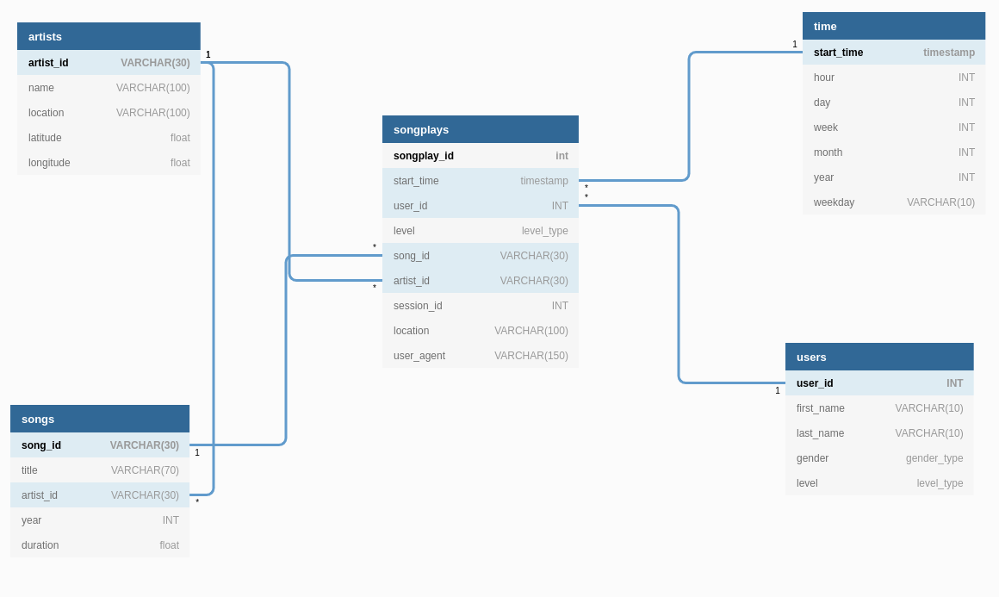

# Project: Data Modeling with Postgres

A startup called Sparkify wants to analyze the data they've been collecting on songs and user activity on their
new music streaming app. The analytics team is particularly interested in understanding what songs users are listening to.

In this project, we'll help them by creating a star schema on Postgres and ETL pipeline for this analysis.

## Dataset Description
The data used in this work are located in the **data folder** and are separated into: **song** and **log** data. Each of these data is described below.

### Song Dataset
Each of the files in this folder contains metadata about a song and the artist of that song. The files are partitioned by the first three letters of
each song's track ID (the letters after the **TR** prefix) and are in JSON format. For instance, here is the file path to one file in this dataset.

```
data/song_data/A/B/A/TRABACN128F425B784.json
```

And below is an example of what a single song file, TRABACN128F425B784.json, looks like.

```
{"num_songs": 1, "artist_id": "ARD7TVE1187B99BFB1", "artist_latitude": null, "artist_longitude": null, "artist_location": "California - LA", "artist_name": "Casual", "song_id": "SOQLGFP12A58A7800E", "title": "OAKtown", "duration": 259.44771, "year": 0}
```

### Log Dataset
This dataset consists of activity logs from a music streaming app in JSON format. The log files are partioned by year and month. For example, here is the file path to one file in this dataset.

```
data/log_data/2018/11/2018-11-01-events.json
```

And below is an example of what the data in a log file, 2018-11-01-events.json, looks like.

```
{"artist":null,"auth":"Logged In","firstName":"Walter","gender":"M","itemInSession":0,"lastName":"Frye","length":null,"level":"free","location":"San Francisco-Oakland-Hayward, CA","method":"GET","page":"Home","registration":1540919166796.0,"sessionId":38,"song":null,"status":200,"ts":1541105830796,"userAgent":"\"Mozilla\/5.0 (Macintosh; Intel Mac OS X 10_9_4) AppleWebKit\/537.36 (KHTML, like Gecko) Chrome\/36.0.1985.143 Safari\/537.36\"","userId":"39"}
{"artist":null,"auth":"Logged In","firstName":"Kaylee","gender":"F","itemInSession":0,"lastName":"Summers","length":null,"level":"free","location":"Phoenix-Mesa-Scottsdale, AZ","method":"GET","page":"Home","registration":1540344794796.0,"sessionId":139,"song":null,"status":200,"ts":1541106106796,"userAgent":"\"Mozilla\/5.0 (Windows NT 6.1; WOW64) AppleWebKit\/537.36 (KHTML, like Gecko) Chrome\/35.0.1916.153 Safari\/537.36\"","userId":"8"}
{"artist":"Des'ree","auth":"Logged In","firstName":"Kaylee","gender":"F","itemInSession":1,"lastName":"Summers","length":246.30812,"level":"free","location":"Phoenix-Mesa-Scottsdale, AZ","method":"PUT","page":"NextSong","registration":1540344794796.0,"sessionId":139,"song":"You Gotta Be","status":200,"ts":1541106106796,"userAgent":"\"Mozilla\/5.0 (Windows NT 6.1; WOW64) AppleWebKit\/537.36 (KHTML, like Gecko) Chrome\/35.0.1916.153 Safari\/537.36\"","userId":"8"}
{"artist":null,"auth":"Logged In","firstName":"Kaylee","gender":"F","itemInSession":2,"lastName":"Summers","length":null,"level":"free","location":"Phoenix-Mesa-Scottsdale, AZ","method":"GET","page":"Upgrade","registration":1540344794796.0,"sessionId":139,"song":null,"status":200,"ts":1541106132796,"userAgent":"\"Mozilla\/5.0 (Windows NT 6.1; WOW64) AppleWebKit\/537.36 (KHTML, like Gecko) Chrome\/35.0.1916.153 Safari\/537.36\"","userId":"8"}
{"artist":"Mr Oizo","auth":"Logged In","firstName":"Kaylee","gender":"F","itemInSession":3,"lastName":"Summers","length":144.03873,"level":"free","location":"Phoenix-Mesa-Scottsdale, AZ","method":"PUT","page":"NextSong","registration":1540344794796.0,"sessionId":139,"song":"Flat 55","status":200,"ts":1541106352796,"userAgent":"\"Mozilla\/5.0 (Windows NT 6.1; WOW64) AppleWebKit\/537.36 (KHTML, like Gecko) Chrome\/35.0.1916.153 Safari\/537.36\"","userId":"8"}
```

## Data Modeling
Next, we present the tables created to perform the queries on song play analysis.

## Dimension Table
1. **artists**: artists in music database
2. **songs**: songs in music database
3. **time**: timestamps of records in **songplays** broken down into specific units
4. **users**: users in the app

## Fact Table
5. **songplays**: records in log data associated with song plays i.e. records with page `NextSong`

The figure below shows the Relational Diagram for this specific star schema.



```
{"artist":null,"auth":"Logged In","firstName":"Walter","gender":"M","itemInSession":0,"lastName":"Frye","length":null,"level":"free","location":"San Francisco-Oakland-Hayward, CA","method":"GET","page":"Home","registration":1540919166796.0,"sessionId":38,"song":null,"status":200,"ts":1541105830796,"userAgent":"\"Mozilla\/5.0 (Macintosh; Intel Mac OS X 10_9_4) AppleWebKit\/537.36 (KHTML, like Gecko) Chrome\/36.0.1985.143 Safari\/537.36\"","userId":"39"}
```
