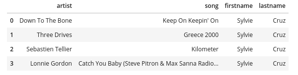
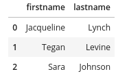

# Project: Data Modeling with Cassandra

A startup called Sparkify wants to analyze the data they've been collecting on songs and user activity on their new music streaming app. 
The analytics team is particularly interested in understanding what songs users are listening to.

In this project, we'll help them by creating a database on Apache Cassandra and ETL pipeline for this analysis.

## Dataset Description
The data used in this work are located in the **event_data folder** and are partitioned by day and are in CSV format. 
For instance, here is the file path to one file in this dataset.

```
event_data/2018-11-01-events.csv
```

And below is an example of what the data in an **event_data** file, 2018-11-01-events.csv, looks like.


## Dataset Denormalization
Before proceeding with data modeling, we must apply denormalization in our data set. The figure below shows the new data set after apply denormalization.


## Data Modeling
We must design tables to answer the following queries.

1. Give me the artist, song title and song's length in the music app history that was heard during sessionId = 338, and itemInSession = 4.

2. Give me only the following: name of artist, song (sorted by itemInSession) and user (first and last name) for userid = 10, sessionid = 182.

3. Give me every user name (first and last) in my music app history who listened to the song 'All Hands Against His Own'.

To do that, we'll use the approach one query for one table.

### Table 1: `session_history_table`
To answer the first question, we must:
- select `artist`, `song`, `length`
- filtering by `sessionId` and `itemInSession`

So, the **partition key** = `sessionId` and the **clustering key** = `itemInSession`. In addition, we include `artist`, `song` and `lenght` as columns in our table.

### Table 2: `user_history_table`
To answer the second question, we must:
- select `artist`, `song` (sorted by `itemInSession`), `firstName`, `lastName`
- filtering by `userId` and `sessionId`

So, the **partition key** = `userId` and the **clustering key** = (`sessionId`, `itemInSession`). Although we can identify a unique row with just the `userId` and `sessionId`, the question asks to show the `song` sorted by `itemInSession`. Therefore, we must add it as one of our **clustering columns**. In addition, we include `artist`, `song`, `firstName` and `lastName` as columns in our table.

### Table 3: `song_history_table`
To answer the third question, we must:
- select `firstName`, `lastName`
- filtering by `song`

So, the **partition key** = `song` and the **clustering key** = (`sessionId`, `itemInSession`). In addition, we include `firstName` and `lastName` as columns in our table.


## Project Files
In addition to the event data files, the project includes five files:

1. `cql_queries.py`: contains all cql queries, and is imported into the files below.
2. `create_tables.py`: drops and creates the sparkify keyspace and the tables. It's necessary to run this file to reset the tables before each time we run the ETL scripts.
3. `etl.py`: reads and processes files from event_data and loads them into the tables.
4. `test.ipynb`: displays the result for each query above.
5. `Project_1B_ Project_Template.ipynb`: the notebook file for the project. 


## Project Execution
To run the project you must run the files in the order below (or you can just run the `Project_1B_ Project_Template.ipynb` notebook).

```
python create_tables.py
python etl.py
```

**Note:** after running the files above, you can run the `test.ipynb` to check the results for each query above.

## Queries Results
Finally, the figures below show the result for the queries above.

1. Give me the artist, song title and song's length in the music app history that was heard during sessionId = 338, and itemInSession = 4.


2. Give me only the following: name of artist, song (sorted by itemInSession) and user (first and last name) for userid = 10, sessionid = 182.



3. Give me every user name (first and last) in my music app history who listened to the song 'All Hands Against His Own'.




